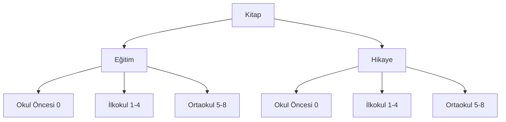

# Damla Okul

> **Dokümantasyon:** Bu projenin belgeleri dört dosyada toplanmıştır; ilgili değişiklikte o dosyayı güncelleyin:
>
> - [README.md](README.md) — Genel bakış, kurulum ve hızlı başlangıç *(bu dosya)*
> - [project.md](project.md) — Teknik mimari ve geliştirme kuralları
> - [design.md](design.md) — Stil, tasarım sistemi ve UI bileşenleri
> - [getdata.md](getdata.md) — Dış veri çekimi (TurkiyeAPI, MEB okullar / okul detay, nüfus)

[damlaokul.com](https://damlaokul.com) — Damla Yayınevi’nin okul yayınları ve eğitim materyallerini tanıtan statik web sitesi.

Yeni Maarif Modeline uygun eğitim setleri, hikaye kitapları ve kataloglar tek bir katalogda sunulur.

## Özellikler

- **Ürün kataloğu** — Sınıf ve tür (Eğitim / Hikaye) bazlı filtreleme, paylaşılabilir hash URL’leri
- **Kitap detay sayfaları** — Kapak, metadata, TYMM alanları (`degerler`, `anatema`, `beceriler`) ve Öykümatik `kazanim` kodları, `preview_link` ile önizleme (İncele), `examlink` ile HDS PDF, `damlaurl` doluysa Satın Al / boşsa Bilgi (tedarik popup)
- **Ürün inceleme linkleri** — `/urun-inceleme-linkleri` sayfasında tüm `preview_link` dolu kitaplar; arama, kopyala ve WhatsApp paylaşımı
- **Kataloglar** — Html / PDF katalog görüntüleme
- **Anasayfa slider** — Kampanya ve duyuru görselleri
- **Instagram carousel** — `@okul.damla` hesabının güncel gönderileri (Behold JSON feed)
- **Spotlight arama** — Lunr.js ile kitap araması (`Ctrl+K`); site genelinde `?q=` deep link ve paylaşılabilir arama URL'si
- **Sticky navbar** — Scroll’da kaybolmayan sabit üst menü (mobil + masaüstü)
- **3 sütunlu footer** — Ürünler, önemli bilgiler, iletişim ve sosyal medya
- **Mobil uyumlu** — Bootstrap 5 responsive grid; hamburger menü alt satırda açılır
- **Statik & hızlı** — Jekyll ile önceden derlenmiş HTML, GitHub Pages üzerinde yayın
- **Performans odaklı** — Lazy arama, yerel fontlar, `<picture>` + WebP, slider lazyload, koşullu script yükleme
- **Öğretmen talep formu** — [`/ogretmen`](/ogretmen) 6 adımlı wizard; kitap listesi + Google Sheets + e-posta ([project.md](project.md#öğretmen-talep-formu-wizard))
- **SEO & AI keşfi** — `robots.txt`, modüler `llms.txt` hub, site geneli `?q=` arama URL'leri, otomatik kitap meta, Product/FAQ JSON-LD, `ai-seo-crawler`, `/sss` sayfası


## Teknoloji


| Katman        | Teknoloji                                                              |
| ------------- | ---------------------------------------------------------------------- |
| Site motoru   | Jekyll 3.10 (`github-pages` gem, Ruby)                                 |
| CSS framework | Bootstrap 5.3 (tasarım sistemi: [design.md](design.md))                |
| Özel stiller  | `theme.css` + `app.css` + `fontawesome-all.min.css`                    |
| JavaScript    | Vanilla JS (filtre, navbar, arama) + Bootstrap bundle + Lunr.js (lazy) |
| Fontlar       | Yerel: Geometric Sans, Punta, Raykjavik (WOFF2), Font Awesome 5.15.4   |
| Yayın         | GitHub Pages                                                           |
| İçerik        | Markdown + YAML front matter                                           |


Node.js veya npm **gerekmez**.

## Hızlı Başlangıç


### Sistem gereksinimleri

Yerel geliştirme için aşağıdaki ortam önerilir. Canlı site GitHub Pages üzerinde derlenir; prod için bu araçların sunucuda kurulu olması gerekmez.

#### Tüm platformlar


| Gereksinim             | Zorunlu | Açıklama                                                                 |
| ---------------------- | ------- | ------------------------------------------------------------------------ |
| **Git**                | Evet    | Repoyu klonlamak ve sürüm kontrolü                                       |
| **Ruby 3.x**           | Evet    | Jekyll ve gem bağımlılıkları (`github-pages` gem — canlı ile aynı sürüm) |
| **Bundler**            | Evet    | `Gemfile` üzerinden gem kurulumu (`install.sh` eksikse kurar)            |
| **Python 3** + **pip** | Evet    | Font WOFF2 subset (`fonttools`, `brotli` — `install.sh` kurar)           |
| **Bash**               | Evet    | `install.sh` / `start.sh` ve `scripts/*.sh` için                         |


Node.js veya npm **gerekmez**.

#### Windows (önerilen: Windows 10 ve üzeri)


| Gereksinim                    | Zorunlu   | Açıklama                                                                                                                        |
| ----------------------------- | --------- | ------------------------------------------------------------------------------------------------------------------------------- |
| **Windows 10+**               | Evet      | Geliştirme ortamı hedefi                                                                                                        |
| **Git for Windows**           | Evet      | [git-scm.com](https://git-scm.com/) — **Git Bash** ile `sh install.sh` / `sh start.sh`                                          |
| **RubyInstaller**             | Evet      | [rubyinstaller.org](https://rubyinstaller.org/) — Ruby 3.x + **Devkit** (MSYS2) seçin; kurulumdan sonra Git Bash'i yeniden açın |
| **winget**                    | Önerilen  | Windows App Installer ile gelir; `install.sh` ImageMagick ve libwebp kurulumunda kullanır                                       |
| **ImageMagick** / **libwebp** | Opsiyonel | Yoksa `install.sh` winget ile kurmayı dener; başarısızsa site jpg/png ile çalışır                                               |


Windows'ta `winget` yoksa (eski Windows veya kurumsal kısıt): ImageMagick'i [imagemagick.org](https://imagemagick.org) üzerinden manuel kurun veya yalnızca jpg/png ile devam edin.

```powershell
# winget kurulu mu kontrol
winget --version

# Manuel kurulum (install.sh başarısızsa)
winget install ImageMagick.ImageMagick
winget install Google.Libwebp
```


#### macOS


| Gereksinim   | Zorunlu  | Açıklama                                                       |
| ------------ | -------- | -------------------------------------------------------------- |
| **Homebrew** | Önerilen | `install_image_tools.sh` → `brew install imagemagick` / `webp` |
| **Ruby 3.x** | Evet     | `brew install ruby` veya RubyInstaller benzeri                 |


#### Linux


| Gereksinim                          | Zorunlu  | Açıklama                                                                       |
| ----------------------------------- | -------- | ------------------------------------------------------------------------------ |
| **imagemagick**, **webp** paketleri | Önerilen | `install_image_tools.sh` → `sudo apt install imagemagick webp` (Debian/Ubuntu) |


#### Özet: ne ne için?


| Araç                | Kullanım                                                          |
| ------------------- | ----------------------------------------------------------------- |
| Ruby + Bundler      | Jekyll build / serve                                              |
| Python + fonttools  | `subset_font.sh` — OTF/TTF → WOFF2                                |
| winget (Windows)    | `install_image_tools.sh` — ImageMagick + libwebp otomatik kurulum |
| ImageMagick / cwebp | `generate_webp.sh` — jpg/png → WebP (`start.sh` hook)             |
| Git Bash            | Windows'ta shell script'leri çalıştırma                           |


### Kurulum (ilk kez)

```bash
git clone https://github.com/<org>/damlaegitim.git
cd damlaegitim
sh install.sh
```

`install.sh` — sıfırdan kurulum (hook yok):

1. Ruby / Bundler kontrolü
2. `bundle install`
3. Python `fonttools` + `brotli`
4. WOFF2 font dönüşümü (`subset_font.sh` — mevcut woff2 güncel ise atlanır)
5. Font boyut kontrolü (`check_fonts.sh`)
6. Görsel araçları (`install_image_tools.sh` — Windows: winget ImageMagick + libwebp)
7. `_data/webp_manifest.yml` yoksa oluşturma
8. `jekyll build` ile kurulum doğrulama


### Yerel geliştirme (kurulum sonrası)

```bash
sh start.sh
```

`start.sh` — geliştirme hook'ları + sunucu:

1. Büyük görselleri raporlar (`check_images.sh`)
2. Eksik WebP üretir (`generate_webp.sh`)
3. Site verisini senkronize eder (`sync_site_data.py` — `docs/data` → `_data` / `assets/data`)
4. `bundle exec jekyll serve`

Tarayıcıda [http://localhost:4000](http://localhost:4000) adresini açın.

Windows’ta Git Bash ile `sh install.sh` ve `sh start.sh` çalıştırılabilir. Alternatif:

```bash
bundle exec jekyll serve
```


### Canlıya alma

```bash
git add .
git commit -m "Değişiklik açıklaması"
git push
```

GitHub Pages otomatik olarak siteyi günceller (klasik Jekyll build — özel Actions yok). Repo ayarları: **Settings → Pages → Deploy from a branch** (`main`, `/ (root)`).

Yerel build, canlı ile aynı stack'i kullanır:

```bash
bundle install
bundle exec jekyll build
```

`bundle exec github-pages health-check` isteğe bağlıdır (Linux/WSL önerilir; Windows'ta libcurl eksikliği nedeniyle başarısız olabilir).

## Kurulum ve geliştirme script'leri


| Script                                                                           | Ne zaman                      | Görev                                                                                                                                              |
| -------------------------------------------------------------------------------- | ----------------------------- | -------------------------------------------------------------------------------------------------------------------------------------------------- |
| `[install.sh](install.sh)`                                                       | İlk kez (`git clone` sonrası) | Ruby gems, fonttools, WOFF2 subset, görsel araçları (winget), `jekyll build` doğrulama — **hook yok**                                              |
| `[start.sh](start.sh)`                                                           | Her geliştirme oturumu        | `check_images` + `generate_webp` + `sync_site_data` hook'ları + `jekyll serve`                                                                                        |
| `[scripts/install_image_tools.sh](scripts/install_image_tools.sh)`               | `install.sh` içinden          | Windows: winget ImageMagick + libwebp; macOS: brew; Linux: apt                                                                                     |
| `[scripts/generate_webp.sh](scripts/generate_webp.sh)`                           | `start.sh` içinden            | `ean/` ve `slides/` için eksik `.webp` üretir; `_data/webp_manifest.yml` günceller                                                                 |
| `[scripts/refresh_image_paths.sh](scripts/refresh_image_paths.sh)`               | Dahili                        | Windows'ta winget kurulum yollarını PATH'e ekler                                                                                                   |
| `[scripts/check_images.sh](scripts/check_images.sh)`                             | `start.sh` içinden            | Büyük görselleri raporlar (dosyaya dokunmaz)                                                                                                       |
| `[scripts/subset_font.sh](scripts/subset_font.sh)`                               | `install.sh` içinden          | OTF/TTF → WOFF2 subset                                                                                                                             |
| `[scripts/check_fonts.sh](scripts/check_fonts.sh)`                               | `install.sh` içinden          | Font boyut uyarı raporu                                                                                                                            |
| `[scripts/normalize_book_frontmatter.rb](scripts/normalize_book_frontmatter.rb)` | Manuel                        | Kitap front matter sıralama; `preview_link`, `examlink`, `damlaurl` korunur; eski `review_link`/`previewpage`/`damlayayinevi` taşınır veya silinir |
| `[scripts/map_story_metadata.rb](scripts/map_story_metadata.rb)`                 | Manuel                        | Tüm `genre: story` kitaplarda `anatema`, `degerler`, `egilimler`, `beceriler`, `unite` eşlemesi — [getdata.md](getdata.md) §4 |
| `[scripts/ogretmen-submit.gs](scripts/ogretmen-submit.gs)`                     | Workspace     | Öğretmen wizard backend; e-tablo Apps Script’ine yapıştırılır — [project.md](project.md#öğretmen-talep-formu-wizard) |
| `[scripts/build_tymm_reference.rb](scripts/build_tymm_reference.rb)`             | Manuel                        | `docs/data/tymm/` ham JSON → birleşik `_data/tymm.json` + `docs/data/tymm/tymmreferans.csv` — [getdata.md](getdata.md) §4 |
| `[scripts/fetch_tymm.py](scripts/fetch_tymm.py)`                                 | Manuel                        | MEB TYMM Chart API + Erdem-Değer ağacı (`--degerler`) → `docs/data/tymm/` — [getdata.md](getdata.md) §4 |
| `[scripts/fetch_turkiyeadres.py](scripts/fetch_turkiyeadres.py)`                 | Manuel                        | TurkiyeAPI → `docs/data/turkiye_adres.json` + sync — [getdata.md](getdata.md)                                                                                 |
| `[scripts/fetch_okullar.py](scripts/fetch_okullar.py)`                           | Manuel                        | MEB kamu kurum listesi → `docs/data/okullar.json` + sync → `assets/data/` — [getdata.md](getdata.md)                                               |
| `[scripts/fetch_ozel_okullar.py](scripts/fetch_ozel_okullar.py)`                 | Manuel                        | OOKGM özel okullar → aynı `okullar.json` (`ozel: true`) — [getdata.md](getdata.md)                                                                  |
| `[scripts/fetch_okuldetay.py](scripts/fetch_okuldetay.py)`                       | Manuel                        | MEB tema siteleri → `docs/data/okullar_detay.json` (`--resume`); bitişte sync — [getdata.md](getdata.md)                                                              |
| `[scripts/sync_site_data.py](scripts/sync_site_data.py)`                         | `start.sh` + fetch bitişi     | `docs/data` → `_data/turkiye_adres_il_ilce.json` + `assets/data/*` (okullar, geodata, okullar-harita il parçaları); eski `_data` büyük JSON kalıntılarını siler — [getdata.md](getdata.md)                                            |


Windows Git Bash'te sıfırdan kurulum: `sh install.sh` → geliştirme: `sh start.sh`.

## Proje Yapısı (özet)

```
_books/          Ürünler (kitap / eğitim seti)
_catalogs/       Kataloglar
_data/           Jekyll data (webp_manifest.yml; turkiye_adres_il_ilce.json → getdata.md)
_pages/          Statik sayfalar + search-index.json
_layouts/        HTML şablonları
_includes/       Ortak bileşenler (menü, kart, filtre, arama, ai-seo-crawler)
assets/css/      Stiller (bootstrap, fontawesome, theme, app, spotlight)
assets/fonts/    Yerel fontlar (geometric-sans, punta, raykjavik, fontawesome)
assets/js/       Script'ler
assets/images/   Görseller, slider ve kapaklar (jpg/png; .webp otomatik üretilebilir)
scripts/         Kurulum ve geliştirme araç script'leri (yukarıdaki tablo)
install.sh       İlk kurulum
start.sh         Geliştirme sunucusu + hook'lar
getdata.md       Dış veri çekimi (TurkiyeAPI, MEB)
index.html       Anasayfa
```

Detaylı mimari için [project.md](project.md), stil için [design.md](design.md), TurkiyeAPI/MEB JSON’ları için [getdata.md](getdata.md).

## SEO ve AI Crawler


| Dosya / URL                        | Açıklama                                                                      |
| ---------------------------------- | ----------------------------------------------------------------------------- |
| `robots.txt`                       | Arama motorları ve AI botlara tam erişim; sitemap + llms hub referansı        |
| `/llms.txt`                        | LLM indeks (hub): özet, bölüm linkleri, iletişim                              |
| `/llms/*.txt`                      | Modüler bölümler: ana sayfalar, eğitim/hikaye kitapları (tümü), kataloglar    |
| `/?q=`                             | Site geneli arama deep link; SearchAction kanonik giriş                       |
| `/sss`                             | Sıkça sorulan sorular (görünür içerik + FAQPage JSON-LD)                      |
| `_includes/search-lunr.html`       | Spotlight arama; `initFromUrlQuery` + `syncUrlQuery` (`history.replaceState`) |
| `_includes/book-seo-tags.html`     | Kitap sayfaları meta / Open Graph / Twitter                                   |
| `_includes/structured-data-*.html` | schema.org JSON-LD (Organization, WebSite, Product, Book, FAQ)                |
| `_includes/related-books.html`     | Kitap detayda ilgili ürünler (grades + genre)                    |
| `_includes/ai-seo-crawler*.html`   | Sayfa türüne göre gizli LLM talimat + bağlam metni                            |


`book-minimal-content.html` **görünür** ince kitap metni; `ai-seo-crawler` **gizli** LLM rehberi (`aria-hidden`, `data-nosnippet`). `llms.txt` site haritası; `ai-seo-crawler` sayfa bağlamı — ikisi birbirini tamamlar.

Kitap `description:` opsiyoneldir; boşsa başlık, sınıf ve türden otomatik üretilir. `previewbook` layout: `book-minimal-content` + tam ekran iframe (gizli `d-none` ölü kod kaldırılmış).

**Doğrulama:** `bundle exec jekyll build` sonrası `_site/robots.txt`, `_site/llms.txt`, `_site/llms/egitim-kitaplari.txt`, `/?q=damla` arama modalı, örnek kitap meta + JSON-LD. Ayrıntılar: [project.md — SEO](project.md#seo-ve-ai-crawler-altyapısı).

## Yeni Ürün Ekleme

1. `_books/` altında yeni bir `.md` dosyası oluşturun
2. Front matter alanlarını doldurun:

```yaml
---
layout: book
title: "Ürün Adı"
categories: ["Hikaye", "Ortaokul"]

# Standart Book Attributes
ean: 9786053832874
preview_link: "https://cdn.e-damla.com.tr/PUBLIC/ornek-sayfalar/9786053832874/index.html"
examlink: ""
damlaurl: ""

# Spesific Filterable Attributes
# degerler: TYMM Erdem-Değer çerçevesi (max 6) | anatema: TYMM Eğilimler | kazanim: Öykümatik kod (H.k.b.n) | beceriler: TYMM Beceriler | unite: TYMM üniteleri (story UI/filtre dışı)
genre: story
grades: [3, 4]
tags: [empati, dedektiflik]
degerler: [Saygı, Dürüstlük, Sorumluluk, Adalet]
anatema: [Saygı, Empati, Merak]
kazanim: [H.1.2.1, H.3.3.3]
beceriler: [Okuma Becerisi, "Problem Çözme Becerisi"]
unite: ["Oyun Dünyası", "Değerlerimizle Varız"]
---
Ürün açıklaması buraya...
```

Eğitim setlerinde (`genre: education`) `akillitahta` bloğu ekleyin; en az bir URL doluysa **Akıllı Tahta İndir** butonu görünür:

```yaml
genre: education
akillitahta:
  exe: ""
  deb: ""
  appimage: ""
  dmg: ""
```

Hikaye kitaplarında `degerler`, `anatema`, `beceriler`, `kazanim` ve `tags` [`book-hero-meta.html`](_includes/book-hero-meta.html) ile başlık altında gösterilir (`unite` story kitaplarda UI'da gösterilmez). Eğitim setlerinde Maarif uyum tablosu gövdede markdown tablo olarak yer alır.

`tags` serbest etiket (`empati`, `Dedektiflik`). `kazanim` yalnızca Öykümatik kod dizisi (`H.1.2.1`); sitede kod olarak gösterilir. `preview_link` doluysa İncele butonu görünür. `examlink` doluysa ve `_config.yml` içinde `examlink: true` ise HDS butonu görünür. `damlaurl` doluysa **Satın Al**, boşsa **Bilgi** (tedarik popup). `genre: education` kitaplarda `akillitahta` (`exe`, `deb`, `appimage`, `dmg`) en az bir URL doluysa **Akıllı Tahta İndir** popup’u açılır; popup’ta Windows / Pardus / macOS etiketleri gösterilir.

1. Kapak görselini `assets/images/ean/{ean}.jpg` olarak ekleyin (jpg/png optimize edin; `.webp` `sh start.sh` ile otomatik üretilir)
2. `sh scripts/check_images.sh` ile boyut kontrolü yapın (veya `sh start.sh` — hook olarak çalışır)
3. `sh start.sh` ile önizleyin
4. Commit ve push


## Kategoriler

Kitaplar iki ana kategoriye ayrılır: Eğitim ve Hikaye. Her biri kademeye göre Okul Öncesi (0), İlkokul (1–4) veya Ortaokul (5–8) alır. 

# Kitap kategorileri: Eğitim / Hikaye + kademe

İki eksen; `genre` türü, `grades` kademeyi verir:

- Ana kategori: `Eğitim` (`genre: education`) veya `Hikaye` (`genre: story`)
- Kademe (her iki tür için aynı): `0` → Okul Öncesi; `1–4` → İlkokul; `5–8` → Ortaokul

Front matter örneği (altı geçerli kombinasyon):

- `categories: ["Eğitim", "Okul Öncesi"]`
- `categories: ["Eğitim", "İlkokul"]`
- `categories: ["Eğitim", "Ortaokul"]`
- `categories: ["Hikaye", "Okul Öncesi"]`
- `categories: ["Hikaye", "İlkokul"]`
- `categories: ["Hikaye", "Ortaokul"]`




`/kategoriler.html` beş düz grup listeler: Eğitim, Hikaye, İlkokul, Ortaokul, Okul Öncesi. Kitap hem türde hem kademede görünür. Hiyerarşik menü bu turun dışında.

## Stil Düzenleme

Renk token’ları, tipografi, bileşen kataloğu ve tasarım kuralları için [design.md](design.md) dosyasına bakın.

Özet: yeni bileşen → `theme.css`; Bootstrap override → `app.css`; `bootstrap.min.css` düzenlenmez.

## Performans ve Görsel Optimizasyonu

Site hızı için uygulanan önlemler:


| Alan            | Uygulama                                                                                   |
| --------------- | ------------------------------------------------------------------------------------------ |
| Hero slider     | Mobil-öncelik `<picture>` + koşullu WebP, mobil LCP preload (webp), `slider-init.js` defer |
| Kitap kapakları | `<picture>` + koşullu WebP, `loading="lazy"`, `fetchpriority="low"`                        |
| Arama           | Lunr lazy-load; indeks `/assets/search-index.json`                                         |
| Scriptler       | Bootstrap `defer`; `book-filter.js` idle init (`requestIdleCallback`); tiny-slider defer   |
| CSS             | `content-visibility` kitap grupları; `tiny-slider.css` anasayfa head'de                    |
| Fontlar         | Font Awesome yerel; Raykjavik WOFF2 subset (~26 KB)                                        |
| Instagram       | Feed `IntersectionObserver` ile gecikmeli yüklenir                                         |


### Görsel politikası


| İş                       | Araç                                                     |
| ------------------------ | -------------------------------------------------------- |
| Resize / JPEG sıkıştırma | **Photoshop** (manuel) — ImageMagick ile resize yapılmaz |
| jpg/png → webp           | `scripts/generate_webp.sh` (`start.sh` hook)             |
| Boyut uyarısı            | `scripts/check_images.sh` — dosyaya dokunmaz             |


Mobil slider `*m.jpg` hedefi: ≤ 120 KB (`sh scripts/check_images.sh slides`). Kod tarafında webp preload ve `<picture>` ile LCP iyileşir; kalıcı küçültme Photoshop ile yapılır.

### Cloudflare mobil benchmark (referans)

Mobil skor ~55; LCP ~11.5 s (büyük mobil jpeg preload + yanlış LCP kaynağı). Kod optimizasyonları: mobil webp preload, mobil-öncelik slider, defer JS, content-visibility. Retest: Cloudflare Speed Test mobil.

### Görsel kontrol scripti

Görseller manuel optimize edilir. Script yalnızca büyük dosyaları raporlar:

```bash
sh scripts/check_images.sh          # Tüm klasörler
sh scripts/check_images.sh slides   # Slider görselleri
sh scripts/check_images.sh ean      # Kitap kapakları
```


### WebP otomatik üretim (hibrit)

`assets/images/ean/` ve `assets/images/slides/` altındaki jpg/png dosyalarından eksik `.webp` varyantları üretilir; manifest `[_data/webp_manifest.yml](_data/webp_manifest.yml)` güncellenir. `[eanimage.html](_includes/eanimage.html)`, `[book-card.html](_includes/book-card.html)` ve `[slider.html](_includes/slider.html)` yalnızca manifest'te kayıtlı webp'ler için `<source type="image/webp">` ekler — araç veya dosya yoksa jpg/png ile devam eder, 404 oluşmaz.


| Aşama                    | Ne yapar                                                                                                                               |
| ------------------------ | -------------------------------------------------------------------------------------------------------------------------------------- |
| `install.sh`             | `install_image_tools.sh` — Windows'ta winget ile ImageMagick (`ImageMagick.ImageMagick`) ve gerekirse libwebp (`Google.Libwebp`) kurar |
| `start.sh`               | `generate_webp.sh` — eksik webp üretir, manifest günceller                                                                             |
| `refresh_image_paths.sh` | Winget kurulum yollarını Git Bash PATH'ine ekler                                                                                       |


```bash
sh scripts/generate_webp.sh         # Manuel çalıştırma
sh start.sh                         # Geliştirme: check_images + generate_webp + jekyll serve
```

Araçlar: `cwebp` (libwebp) veya ImageMagick (`magick`). Kurulumda otomatik denenir; yoksa site jpg ile çalışır. Üretilen `.webp` dosyalarını commit etmek prod GitHub Pages için önerilir.

### Font WOFF2 üretimi

```bash
pip install fonttools brotli   # bir kez
sh scripts/subset_font.sh      # Tüm fontlar için WOFF2 oluşturur (fontawesome hariç)
```


### Cloudflare

Site şu an Cloudflare DNS-only modunda (gri bulut).

## Instagram Carousel

Anasayfada `@okul.damla` gönderilerini gösteren carousel modülü `[_includes/instagram-carousel.html](_includes/instagram-carousel.html)` dosyasındadır. Tek dosyada inline HTML, CSS ve JS içerir.

### Kurulum

1. [behold.so](https://behold.so) üzerinde `okul.damla` hesabını bağlayın
2. Çıktı tipi **JSON** olan bir feed oluşturun
3. `_config.yml` içindeki `instagram_carousel.feed_url` alanına feed URL’sini yazın:

```yaml
instagram_carousel:
  username: okul.damla
  profile_url: https://instagram.com/okul.damla
  feed_url: 'https://feeds.behold.so/XXXX'
  limit: 12
```

Başka bir sayfaya eklemek için:

```liquid

```


## Spotlight Arama

Navbar’daki arama kutusu veya `Ctrl+K` / `⌘K` ile kitap araması açılır. Sonuçlar kapak görseli, başlık, yazar ve sınıf/tür bilgisiyle listelenir.

- **Masaüstü** — Navbar’da tam arama kutusu + `Ctrl+K`
- **Mobil** — Logo ile hamburger menü arasında minimal `Kitap ara...` çubuğu (collapse dışında, her zaman görünür)
- İndeks: `site.books` → build-time `/assets/search-index.json` (kapak: `assets/images/ean/{ean}.webp|jpg`)
- Lunr alanları: `title`, `ean`, `authors`, `categories`, `grades`, `genre`, `unite`, `anatema`, `kazanim`, `beceriler`, `tags`, `body`
- 4+ haneli sayısal sorgularda barkod (`ean`) doğrudan eşleştirme; diğer aramalarda Lunr wildcard
- Lunr.js yalnızca arama açılınca yüklenir (sayfa yükü azaltılır)
- Dosyalar: `[_includes/search-lunr.html](_includes/search-lunr.html)`, `[_pages/search-index.json](_pages/search-index.json)`, `[assets/js/lunr.js](assets/js/lunr.js)`


## Navbar

Üst menü (`#MagicMenu`) scroll sırasında sabit kalır; aşağı kaydırınca gizlenmez.

- Yapı: mobilde logo + arama + hamburger üst satır; menü linkleri alt satırda tam genişlik
- Script: `[assets/js/nav.js](assets/js/nav.js)` (`--nav-height` senkronizasyonu, scroll gölgesi)


## Kitap Detay Popup’ları

Tanıtım (YouTube), Satın Al / Bilgi, İncele, HDS ve Akıllı Tahta İndir butonları `[_includes/popup.html](_includes/popup.html)` ile açılır (`[_includes/book-detail-actions.html](_includes/book-detail-actions.html)`). `damlaurl` doluysa **Satın Al** ürün sayfasını iframe’de açar; boşsa **Bilgi** tedarik popup’unu gösterir. HDS yalnızca `_config.yml` içinde `examlink: true` ve kitap `examlink` doluysa görünür. İncele yalnızca `preview_link` dolu kitaplarda görünür. **Akıllı Tahta İndir** yalnızca `genre: education` ve `akillitahta` altında en az bir dolu URL (`exe`, `deb`, `appimage`, `dmg`) varsa görünür. Tedarik popup’u iPhone koyu temada okunabilir metin renklerine sahiptir.

## Footer

Site alt bilgisi `[_includes/footer-menu.html](_includes/footer-menu.html)` ile 3 sütunlu olarak gösterilir:

1. **Ürünler** — Eğitim / Hikaye kitapları (`/urunler`) ve kataloglar sayfası
2. **Önemli Bilgiler** — `footer_show: true` olan `_pages` kayıtları (`footer_order` ile sıralama)
3. **Adres & İletişim** — `_config.yml` içindeki `contact_`* alanları + sosyal medya ikonları


### İletişim bilgileri

Telefon, e-posta ve adres `_config.yml` kök seviyesinde tanımlanır:

```yaml
contact_phone: "+90 212 514 28 28"
contact_phone_href: "tel:+902125142828"
contact_email: "iletisim@damlayayinevi.com.tr"
contact_address: "Alemdar Mh. Prof. Kazım İsmail Gürkan Cad. No:8 Fatih, 34110 İstanbul"
```

Paylaşılan partial: `[_includes/contact-info.html](_includes/contact-info.html)`

```liquid
  {# footer #}
   {# iletişim sayfası #}
```

Yeni bir sayfayı footer’da listelemek için front matter’a `footer_show: true` ve `footer_order` ekleyin.

## Sayfalar


| URL                       | Açıklama                                                                 |
| ------------------------- | ------------------------------------------------------------------------ |
| `/`                       | Anasayfa — slider + Instagram carousel + sınıf/tür filtreli ürün listesi |
| `/urunler`                | Tüm ürünler, sınıf/tür nav filtresi, hash URL desteği                    |
| `/urunler/:title`         | Ürün detay                                                               |
| `/kataloglar`             | Katalog listesi                                                          |
| `/kataloglar/:title`      | Katalog detay                                                            |
| `/urun-inceleme-linkleri` | Ürün inceleme linkleri — `preview_link` dolu kitaplar, arama + paylaşım  |
| `/ogretmen`               | Öğretmen talep formu — sınıf, okuma/eğitim listesi, iletişim, Sheets gönderimi |
| `/hakkimizda`             | Hakkımızda                                                               |
| `/iletisim`               | İletişim                                                                 |


## Filtre URL’leri

Anasayfa ve `/urunler` sayfasında sınıf/tür filtresi URL hash ile paylaşılabilir (Jekyll rebuild gerekmez):

```
/urunler#okul-oncesi          → Okul öncesi (tüm türler)
/urunler#okul-oncesi/egitim   → Okul öncesi, eğitim
/urunler#1-sinif/hikaye       → 1. sınıf, hikaye
/#2-sinif/egitim              → Anasayfa, 2. sınıf eğitim
```

Nav’dan filtre seçildiğinde URL otomatik güncellenir; hash ile açılan sayfada filtre sayfa yüklenirken uygulanır.

## Lisans ve İletişim

© Damla Yayınevi — [damlaokul.com](https://damlaokul.com)

- [Facebook](https://www.facebook.com/damlayayinevi)
- [Instagram (Damla Yayınevi)](https://instagram.com/damlayayinevi)
- [Instagram (Damla Okul)](https://instagram.com/okul.damla)
- [YouTube](https://www.youtube.com/c/damlayayinevi)
- [Twitter](https://twitter.com/damlayayinevi)

