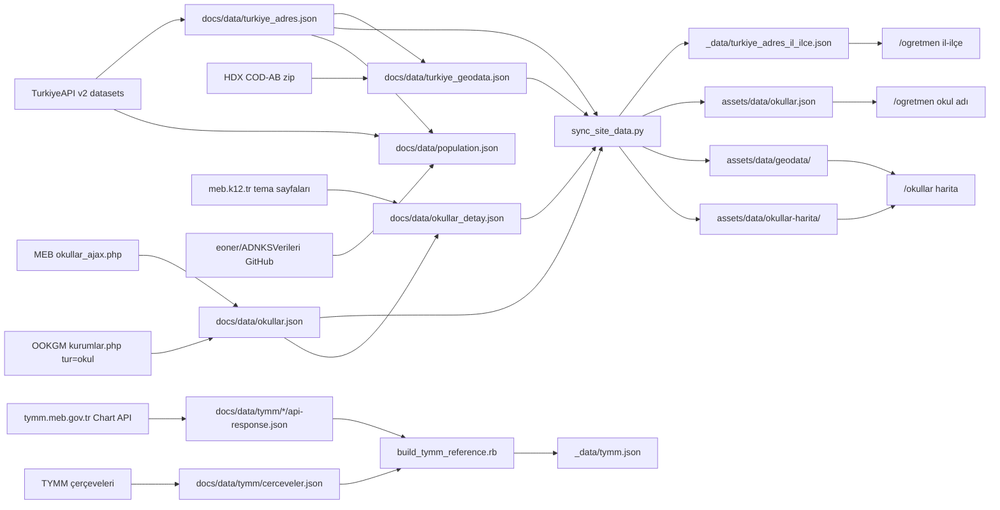
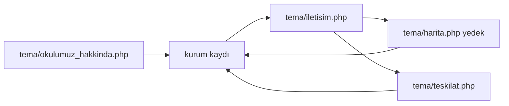

# Damla Okul — Dış veri çekimi

> **Dokümantasyon:** Kurulum [README.md](README.md), mimari [project.md](project.md), tasarım [design.md](design.md). **Bu dosya** TurkiyeAPI, MEB, OOKGM ve HDX kaynaklı JSON’ların tek takip belgesidir; script veya şema değişince burayı güncelleyin.

Öğretmen talep formu (`/ogretmen`) ve okul meta verisi, sitede durağan JSON olarak tutulur. Üretim **yedi Python 3 fetch script’i** + **bir sync script** + **bir Ruby build script** ile yapılır (yalnızca standart kütüphane; `pip` yok). Fetch script’leri `install.sh` / `start.sh` içinde otomatik çalışmaz; [`scripts/sync_site_data.py`](scripts/sync_site_data.py) yalnızca `start.sh` hook’unda tetiklenir (`docs/data` → site dosyaları). TYMM işlenmiş çıktısı (`_data/tymm.json`) doğrudan `build_tymm_reference.rb` ile üretilir; sync’e dahil değildir.

| Script | Kanonik çıktı (`docs/data/`) | Site türetilmiş | Yaklaşık boyut | Tüketici |
|--------|------------------------------|-----------------|----------------|----------|
| [`scripts/fetch_turkiyeadres.py`](scripts/fetch_turkiyeadres.py) | `turkiye_adres.json` | `_data/turkiye_adres_il_ilce.json` (sync) | ~4,7 MB → ~80 KB | Wizard il/ilçe (Jekyll); diğer fetch script’leri kod eşlemesi |
| [`scripts/fetch_geodata.py`](scripts/fetch_geodata.py) | `turkiye_geodata.json` | `assets/data/geodata/` (sync) | ~48 MB → il parçaları | `/okullar` harita sınır overlay |
| [`scripts/fetch_okullar.py`](scripts/fetch_okullar.py) | `okullar.json` | `assets/data/okullar.json` (sync) | ~9–21 MB | Wizard okul adı (`<datalist>`); `fetch_okuldetay.py` girdi |
| [`scripts/fetch_ozel_okullar.py`](scripts/fetch_ozel_okullar.py) | Aynı `okullar.json` (`ozel: true`) | sync | kamu dosyasına ek | Wizard datalist; detay script’i atlar |
| [`scripts/fetch_okuldetay.py`](scripts/fetch_okuldetay.py) | `okullar_detay.json` (monolit) | `assets/data/okullar-harita/{il_kod}.json` (sync) | ~90 MB → il parçaları | `/okullar` harita detay + koordinat |
| [`scripts/fetch_population.py`](scripts/fetch_population.py) | `population.json` | — (sync yok) | ~300 KB | (ileride harita / analiz) |
| [`scripts/fetch_tymm.py`](scripts/fetch_tymm.py) | `tymm/*/api-response.json` + `tymm/cerceveler.json` | `_data/tymm.json` (`build_tymm_reference.rb`) | ~100 KB ham → ~100 KB işlenmiş | Öğretmen sihirbazı; hikâye müfredat eşlemesi |
| [`scripts/sync_site_data.py`](scripts/sync_site_data.py) | — | `turkiye_adres_il_ilce` + `assets/data/*` | türetilmiş | `start.sh`; fetch script’leri bitişte de çağırır |

Sıra zorunlu: adres → (isteğe bağlı geodata) → kamu kurum listesi → özel birleştirme → kurum detayı. Nüfus (`fetch_population.py`) bağımsız; `turkiye_adres.json` önkoşul.



---

## Ortak kurallar

- Çalıştırma: repo kökünden `python scripts/<script>.py` (Windows Git Bash veya sistem Python 3).
- Ağ: nazik tarama — gecikme, 4 deneme, üstel bekleme. Toplu tarama saatler sürebilir.
- JSON: UTF-8, `ensure_ascii=False`. Adres dosyası girintili; `okullar` / `okullar_detay` / `turkiye_geodata` sıkışık (`separators=(",", ":")`).
- **Kanonik dosyalar** `docs/data/` altında (gitignore: `/docs`; Jekyll `_config.yml` `exclude`). Büyük JSON’lar git’te **tutulmaz**; site için `sync_site_data.py` veya `start.sh` kullanın.
- `_data/turkiye_adres_il_ilce.json` (~80 KB) git’te kalır; clone sonrası il/ilçe wizard sync olmadan çalışır.
- **`_data/okullar_detay.json` kullanılmaz.** Eski mimariden kalan kopya Jekyll build’ini kırar; `sync_site_data.py` başında ve sonunda otomatik silinir; `start.sh` Jekyll öncesi `--cleanup-only` tekrar çağırır (IDE’de açık dosya veya paralel fetch geri yazabilir).
- `--il` kamu script’inde plaka / TurkiyeAPI `kod` (`1` Adana, `34` İstanbul); OOKGM script’inde il adı veya plaka (`ANKARA` / `6`). MEB Bakanlık kaydı il kodu `99` yalnızca kamu listesinde vardır.

---

## 1. Türkiye adresi (`fetch_turkiyeadres.py`)

[TurkiyeAPI v2](https://docs.turkiyeapi.dev/tr/) idari birimleri: il → ilçe → mahalle / köy.

### Kaynak

| Dataset | URL |
|---------|-----|
| Meta | `https://api.turkiyeapi.dev/v2/meta` |
| Ham listeler | `https://api.turkiyeapi.dev/v2/datasets/{provinces,districts,neighborhoods,villages}.json` |

İsteğe bağlı yerel kopya: `docs/data/reference/turkiyeapi/` (`--vendor` yazar, `--from-vendor` okur).

### Komut

```bash
python scripts/fetch_turkiyeadres.py
python scripts/fetch_turkiyeadres.py --vendor
python scripts/fetch_turkiyeadres.py --from-vendor docs/data/reference/turkiyeapi
python scripts/fetch_turkiyeadres.py --output docs/data/turkiye_adres.json
```

Çıktı sayısı kaynak dataset satır sayısıyla doğrulanır; uyuşmazsa script hata verir.

### Şema (`turkiye_adres.json`)

```json
{
  "meta": {
    "kaynak": "https://docs.turkiyeapi.dev/tr/",
    "api": "https://api.turkiyeapi.dev/v2",
    "datasetVersion": "2025",
    "guncelleme": "YYYY-MM-DD",
    "lastUpdated": "API lastUpdated"
  },
  "iller": [
    {
      "kod": 1,
      "ad": "Adana",
      "ilceler": [
        {
          "kod": 1757,
          "ad": "Aladağ",
          "mahalleler": [{ "kod": 248, "ad": "Akpınar" }],
          "koyler": [{ "kod": 0, "ad": "…" }]
        }
      ]
    }
  ]
}
```

- `iller`: 81 il (Bakanlık yok). `kod` plaka ile aynı.
- İlçe / mahalle / köy `kod` değerleri TurkiyeAPI id’leridir; MEB ilçe kodu değildir.
- Wizard il-ilçe seçimi bu ağacın **yalnızca il ve ilçe** katmanını Jekyll ile sayfaya gömer (`ogretmen-adres-il-ilce`). Mahalle/köy formda kullanılmaz.

---

## 2. MEB kurum listesi (`fetch_okullar.py`)

[MEB Okullar ve Diğer Kurumlar](https://www.meb.gov.tr/baglantilar/okullar/index.php) DataTables AJAX çıktısı.

**Önkoşul:** `docs/data/turkiye_adres.json` mevcut olmalı. İl/ilçe adları bu dosyadaki kodlara çözülür (`Afyon` → Afyonkarahisar, `19mayis` → 19 Mayıs gibi takma adlar script içindedir).

### Kaynak

1. `index.php` — il `<select>` (başarısızsa plaka 1–81 + Bakanlık `99`).
2. `okullar_ajax.php` — il bazında `start`/`length=500` sayfalama, `ilce=0` (tüm ilçeler). İl başına `recordsTotal` bitene kadar.

Satır alanları: `OKUL_ADI` (`İL - İLÇE - AD`), `HOST` (`ornek.meb.k12.tr` host parçası), `YOL` (kurum kodu yolu).

### Komut

```bash
python scripts/fetch_okullar.py
python scripts/fetch_okullar.py --il 1
python scripts/fetch_okullar.py --output docs/data/okullar.json
```

`--il` yalnızca o ili çeker; çıktı dosyasını **tüm ülkenin üzerine yazar** (kısmi dosyayı `okullar.json` sanmayın). Tam liste için argümansız çalıştırın.

Gecikme: il içi sayfalar ve iller arası 0,4 sn. Tam tarama onlarca dakika sürebilir.

Çıktı `docs/data/okullar.json`; bitişte `sync_site_data.py` `assets/data/okullar.json` üretir. Dosya **sıfırdan** yazılır; önceki OOKGM özel kayıtlar silinir — ardından [`fetch_ozel_okullar.py`](scripts/fetch_ozel_okullar.py) çalıştırın.

### Şema (`okullar.json`)

```json
{
  "kaynak": "https://www.meb.gov.tr/baglantilar/okullar/index.php",
  "referans": "docs/data/turkiye_adres.json",
  "guncelleme": "YYYY-MM-DD",
  "sayi": 67754,
  "kaynak_ozel": "https://ookgm.meb.gov.tr/kurumlar.php?tur=okul",
  "sayi_ozel": 12552,
  "iller": {
    "1": {
      "ad": "Adana",
      "ilceler": {
        "1104": {
          "ad": "Seyhan",
          "kurumlar": [
            {
              "ad": "125. Yıl Ortaokulu",
              "tur": "Ortaokul",
              "kurum_kodu": "726071",
              "web": "https://125yilortaokuluseyhan.meb.k12.tr/"
            }
          ]
        }
      }
    }
  }
}
```

| Alan | Not |
|------|-----|
| `iller` / `ilceler` anahtarı | TurkiyeAPI `kod` (string). Eşleşmeyen ilçe kodu `"0"`. |
| `tur` | Kamu: kurum adından kural tablosu (`İlkokul`, `Fen Lisesi`, `Özel Eğitim`, …); bilinmeyen → `Diğer`. Özel: OOKGM resmi tür alanı (ör. `Özel Türk İlkokulu`); `infer_tur()` uygulanmaz. |
| `ozel` | Yalnızca OOKGM kayıtlarında `true`. Kamu kayıtlarda alan yoktur. |
| `kurum_kodu` | MEB yolunun son parçası; detay JSON’un anahtarı. Özel kayıtlarda **yok**. |
| `web` | `https://{HOST}.meb.k12.tr/` — yoksa alan yazılmaz. Özel kayıtlarda **yok**. |
| `adres` / `telefon` | OOKGM özel kayıtlarda doldurulur (varsa). |
| `99` | Bakanlık / merkezi kurumlar; ilçe kodu `0`. |
| `kaynak` | Kamu MEB URL’si (değişmez). |
| `kaynak_ozel` / `sayi_ozel` | OOKGM birleştirmesinden sonra; `sayi` kamu + özel toplamdır. |

Eşleşmeyen il/ilçe sayısı stderr’de `[UYARI]` olarak raporlanır; kayıt yine yazılır.

Kamu listesindeki “Özel” neredeyse tamamen **Özel Eğitim** veya **Özel İdare** adlarıdır; koleji / “Özel … İlkokulu” sicili OOKGM’den gelir.

---

## 2b. OOKGM özel okullar (`fetch_ozel_okullar.py`)

[OOKGM kurumlar.php?tur=okul](https://ookgm.meb.gov.tr/kurumlar.php?tur=okul) — özel okul sicili (ilçe, resmi tür, adres, telefon). **Kurum kodu ve web yok.** Kurs / yurt / rehabilitasyon (`tur=okul` dışı) çekilmez.

**Önkoşul:** `docs/data/okullar.json` (kamu listesi) ve `docs/data/turkiye_adres.json`. `fetch_okullar.py` yeniden çalıştırılmaz; mevcut dosyaya eklenir.

### Kaynak

1. `kurumlar.php?tur=okul` — il `<select>`. Listede olmayan iller (ör. Ardahan) `docs/data/turkiye_adres.json` ile denenir; sunucu varsayılan ile (Adana) dönerse kayıt **yazılmaz**.
2. Her il: `GET kurumlar.php?sayfa=N&tur=okul&il=ADANA&tur2=0`. Sayfa boyu ~250. İlk HTML’deki `sayfa=` linklerinden max sayfa okunur; `N=1..max` dolaşılır.
3. Tablo: ilçe, ad (BÜYÜK HARF → `title_tr`), tür (OOKGM resmi metin), adres, telefon (`tel:` veya rakam).

Sitedeki “N adet kurum bulundu” sayacı sayfa linkleriyle uyuşmayabilir (ör. Ankara 1565 yazar, tabloda 1450 benzersiz satır). Script tablo satırını kaynak alır; farkı `[UYARI]` basar.

ÖSYM 2017–2018 “Ortaöğretim Kurumları Kitapçığı” 2026’da yayımlanmıyor; okul bazında kod listesi yok. Bu script ÖSYM PDF/kılavuz birleştirmez.

### Komut

```bash
python scripts/fetch_ozel_okullar.py
python scripts/fetch_ozel_okullar.py --il ANKARA
python scripts/fetch_ozel_okullar.py --delay 0.4 --output docs/data/okullar.json
```

`--il` yalnızca o ilin `ozel === true` kayıtlarını silip taze OOKGM listesini yazar; kamu kayıtlara ve diğer illerin özel kayıtlarına dokunmaz. Üretim için argümansız çalıştırın (tüm özel kayıtlar yenilenir). Testte `--output` ile geçici dosya kullanın.

Gecikme varsayılan 0,4 sn. Çıktı kanonik yoldaysa bitişte `sync_site_data.py` `assets/data/okullar.json` üretir.

2026-08-22 tam çekim: `sayi=67754`, `sayi_ozel=12552` (kamu 55202). OOKGM `<select>` 80 il; Ardahan yok. 2 kayıt kamu adıyla çakıştığı için atlandı.

### Birleştirme

- Yeniden çalıştırmada önce ilgili `ozel === true` kayıtlar silinir, sonra taze liste eklenir.
- Çakışma (aynı il/ilçe + `fold_tr(ad)`): kamu kaydı durur; özel atlanır, uyarı sayacı.
- `fetch_okuldetay.py` `kurum_kodu` + `web` olmayanı zaten atlar; özel kayıtlar detaya girmez.
- Wizard `populateSchoolList` yalnızca `kurum.ad` kullanır; özel okullar datalist’e düşer (ayrı rozet yok).

Özel kayıt örneği:

```json
{
  "ad": "Özel Adana Doğa İlkokulu",
  "tur": "Özel Türk İlkokulu",
  "ozel": true,
  "adres": "BELEDİYE EVLERİ MAH. …",
  "telefon": "3222471144"
}
```

---

## 3. MEB okul detayı (`fetch_okuldetay.py`)

Her kurumun `web` adresindeki tema sayfalarından meta. **Girdi:** `docs/data/okullar.json` (`kurum_kodu` + `web` dolu olanlar; OOKGM özel kayıtlar atlanır).

### Sayfalar



| Sayfa | Ne alınır |
|-------|-----------|
| `tema/okulumuz_hakkinda.php` | Derslik / öğretmen / öğrenci, iletişim (varsa), şablon (`tema-2`…`tema-6`). İstatistik yoksa anasayfa yedek. |
| `tema/iletisim.php` | Boş telefon / belgegeçer / adres / e-posta / ulaşım; harita koordinatı. |
| `tema/harita.php` | Yalnızca `enlem` yoksa. `?R=1` kullanılmaz (JS yönlendirme). 500 kaydı bozmaz, atlanır. |
| `tema/teskilat.php` | Tüm açık kadro. `idari_personel/*.html` **çekilmez**. |

Koordinat: iframe `maps/embed` `q=lat,lng`, `LatLng()`, `@lat,lng`, `ll=`, `data-lat`/`data-lng`. Türkiye kutu kontrolü (~35–43,5 N, 25–45,5 E). `harita_url` = `https://www.google.com/maps?q={enlem},{boylam}`.

Kadro (`ul#seviyeN a`): `ad`, `unvan` (`title` / `alt` / `<span>`), `seviye`, varsa `telefon` / `eposta`. Boş anahtar yazılmaz.

- Bitişik unvan: `HASAN BİLİCİOKUL MÜDÜRÜ` → ad + unvan.
- Maskeli ad (`YU.. ME..`, en az iki `..`): ek alan yoksa satır atlanır; unvan/telefon/eposta varsa **maskeli `ad` olduğu gibi** yazılır.
- `mudur`: unvanı müdür (yardımcı değil) olan ilk **açık** isim; yoksa teşkilatın ilk açık adı. Hepsi maskeliyse alan yazılmaz.
- Placeholder ad (`.`, `-`) atlanır.

SSL: OpenSSL, host adındaki `_` karakterini joker `*.meb.k12.tr` ile reddeder. Script bu hostlarda `check_hostname` kapatır, SAN’ı kendisi doğrular.

### Resume (kritik)

Varsayılan mevcut `docs/data/okullar_detay.json` üzerine devam eder.

| Durum | Davranış |
|-------|----------|
| `durum=ok` **ve** `iletisim_durum` dolu | Atla (tamamlanmış). |
| `durum=ok` ama `iletisim_durum` yok | Hakkında **yeniden çekilmez**; yalnızca iletisim (+ harita yedek) + teskilat. İstatistikler korunur. |
| Diğer (`parse_eksik`, `http_hata`, yok) | Hakkında + ekstra sayfalar. |
| `--force` | Her şeyi baştan (hakkinda + iletisim + teskilat). |
| `--no-resume` | Çıktı dosyasını yok say, sıfırdan. |

`--limit` / `--il` / `--kurum-kodu` hedef kümeyi daraltır; resume kuralları aynı kalır.

Gecikme varsayılan 0,3 sn (okullar arası). Checkpoint: her 100 kurumda atomik yazım (`*.tmp` → replace). `Ctrl+C` mevcut durumu yazar (çıkış 130).

Tam tarama (~55k × 2 istek + seyrek harita) birçok saat sürer. Kesilirse aynı komutu tekrarlayın.

### Komut

```bash
python scripts/fetch_okuldetay.py
python scripts/fetch_okuldetay.py --il 1 --limit 20
python scripts/fetch_okuldetay.py --kurum-kodu 726071
python scripts/fetch_okuldetay.py --force --kurum-kodu 726071
python scripts/fetch_okuldetay.py --delay 0.5
python scripts/fetch_okuldetay.py --prune
```

Doğrulama örnekleri (Adana, tema 3/4/6): 125. Yıl Ortaokulu (`726071`), 19 Mayıs Anadolu Lisesi (`111512`), 5 Ocak Ortaokulu (`726185`).

### Şema (`okullar_detay.json`)

Kök:

```json
{
  "kaynak": "meb.k12.tr/tema/okulumuz_hakkinda.php+iletisim.php+teskilat.php",
  "referans": "docs/data/okullar.json",
  "guncelleme": "YYYY-MM-DD",
  "sayi": 55202,
  "kurumlar": {
    "726071": { }
  }
}
```

Kayıt alanları (hepsi her okulda yok; boş anahtar yazılmaz):

| Alan | Anlam |
|------|--------|
| `kurum_kodu`, `web` | Girdi kopyası |
| `sablon` | `tema-2` … `tema-6` veya `bilinmiyor` |
| `durum` | `ok` \| `parse_eksik` \| `http_hata` \| `zaman_asimi` |
| `derslik_sayisi`, `ogretmen_sayisi`, `ogrenci_sayisi` | Tam sayı |
| `telefon`, `belgegecer`, `adres`, `eposta` | İletişim (`eposta` yalnızca geçerli adres; `mailto:` veya metin) |
| `enlem`, `boylam` | float |
| `harita_url` | Google Maps `q=` |
| `mudur` | Açık müdür adı |
| `kadro` | `[{ "ad", "unvan", "seviye", "telefon", "eposta" }]` |
| `alanlar` | Eşleşmeyen etiket→değer (Vizyon, Misyon, Başarılar, Saatler, Yerleşim Yeri, İl/İlçe Merkezine Uzaklık, Ulaşım, Servis/Pansiyon, Isınma, Yazdır/Web atlanır) |
| `iletisim_durum` | `ok` \| `yok` \| `hata` — iletisim.php denendi; resume anahtarı |

İletisim/teskilat, mevcut hakkinda alanlarının **üstüne yazmaz** (boşsa doldurur).

---

## 4. TYMM müfredat verisi (`fetch_tymm.py` + `build_tymm_reference.rb`)

[MEB TYMM](https://tymm.meb.gov.tr/) verisi `_data/tymm.json` içinde **iki katmandan** oluşur; ikisi de aynı build çıktısındadır:

| Katman | MEB kaynağı | `tymm.json` alanı | Ne içerir |
|--------|-------------|-------------------|-----------|
| **Çerçeveler** (resmi sözlük) | `/beceriler/*` accordion sayfaları | `cerceveler` | Kodlu tam ağaç: D1→D1.1→D1.1.1, E1→E1.1, KB2→KB2.1→KB2.1.SB1… |
| **Müfredat** (ünite etiketleri) | Ders programı grafik API | `grades` | Sınıf → ünite → `degerler` / `egilimler` / `beceriler` **düz etiket listeleri** |

**Önkoşul:** yok (okul fetch zincirinden bağımsız).

### A. Çerçeveler — Değerler, Beceriler, Eğilimler (tam ağaç)

Tek komutla üç resmi çerçeve `docs/data/tymm/cerceveler.json` dosyasına yazılır; `build_tymm_reference.rb` bunu `cerceveler` altına kopyalar.

| Bölüm | Kaynak | Hiyerarşi |
|-------|--------|-----------|
| `degerler` | [Erdem-Değer-Eylem](https://tymm.meb.gov.tr/beceriler/erdem-deger-eylem-cercevesi) | D1… → D1.1… → D1.1.1… (20 değer, 70 alt, 405 süreç) |
| `beceriler` | 5 beceri sayfası (tablo) | KB/SDB/OB/MAB… → alt → *.SB* |
| `egilimler` | [Eğilimler](https://tymm.meb.gov.tr/beceriler/egilimler) | E1… → E1.1… (3 grup, 21 eğilim) |

Beceri alt anahtarları (`cerceveler.beceriler`):

| Anahtar | Slug | Kaynak |
|---------|------|--------|
| `kavramsal` | `kavramsal-beceriler` | [Kavramsal Beceriler](https://tymm.meb.gov.tr/beceriler/kavramsal-beceriler) |
| `alan` | `alan-becerileri` | [Alan Becerileri](https://tymm.meb.gov.tr/beceriler/alan-becerileri) |
| `sosyal_duygusal` | `sosyal-duygusal-ogrenme-becerileri` | [Sosyal-Duygusal Öğrenme](https://tymm.meb.gov.tr/beceriler/sosyal-duygusal-ogrenme-becerileri) |
| `sosyal_bilimler` | `sosyal-bilimler-alan-becerileri` | [Sosyal Bilimler Alan Becerileri](https://tymm.meb.gov.tr/beceriler/sosyal-bilimler-alan-becerileri) |
| `okuryazarlik` | `okuryazarlik-becerileri` | [Okuryazarlık Becerileri](https://tymm.meb.gov.tr/beceriler/okuryazarlik-becerileri) |

### B. Müfredat — ders programı sayfalarından ünite bileşenleri

Ders programı sayfalarındaki **Beceri Dağılımı** grafiği `Chart/GetStackCharts` API üzerinden çekilir. Grafikteki her tema (ünite) için **Değerler**, **Eğilimler** ve **Beceriler** sütunları ayrıştırılıp `grades.{sinif}.unites[]` altına düz liste olarak yazılır (kod veya alt ağaç yok; yalnızca etiket adları).

| Ders programı sayfası | API slug | Sınıflar | Durum |
|----------------------|----------|----------|-------|
| [İlkokul Türkçe](https://tymm.meb.gov.tr/ogretim-programlari/ders/ilkokul-turkce-dersi) | `ilkokul-turkce-dersi` | 1–4 | ✅ çekiliyor |
| [Ortaokul Türkçe](https://tymm.meb.gov.tr/ogretim-programlari/ders/ortaokul-turkce-dersi) | `ortaokul-turkce-dersi` | 5–8 | ✅ çekiliyor |
| [Türk Dili ve Edebiyatı](https://tymm.meb.gov.tr/ogretim-programlari/ders/turk-dili-ve-edebiyati-dersi) | `turk-dili-ve-edebiyati-dersi` | Hazırlık, 9–12 | ❌ henüz dahil değil |

API uç noktası: `GET https://tymm.meb.gov.tr/Chart/GetStackCharts?url={slug}`

Ham yanıt `stackedChart[]` içinde HTML gömülü tema listeleri taşır; `build_tymm_reference.rb` bunları ünite / etiket yapısına dönüştürür. Etiketler `cerceveler` sözlüğündeki adlarla örtüşür (ör. ünitede `"Merak"` → `cerceveler.egilimler` içinde `E1.1`); ancak müfredat katmanı kod içermez.

### Komut

```bash
# Tam güncelleme (önerilen)
python scripts/fetch_tymm.py --cerceveler          # cerceveler.json (değerler + beceriler + eğilimler ağaçları)
python scripts/fetch_tymm.py                       # ilkokul + ortaokul müfredat API
ruby scripts/build_tymm_reference.rb               # → _data/tymm.json

# Parçalı
python scripts/fetch_tymm.py --only ilkokul-turkce
python scripts/fetch_tymm.py --from-vendor         # ağsız doğrulama
```

Ham dosyalar (`docs/data/tymm/`, gitignore):

| Dosya | Komut | İçerik |
|-------|-------|--------|
| `cerceveler.json` | `--cerceveler` | Resmi çerçeve ağaçları (3 grup) |
| `ilkokul-turkce/api-response.json` | varsayılan fetch | 1–4. sınıf grafik ham verisi |
| `ortaokul-turkce/api-response.json` | varsayılan fetch | 5–8. sınıf grafik ham verisi |

Site çıktısı: **`_data/tymm.json`** (tek dosya; `cerceveler` + `grades` + `meta`). `build_tymm_reference.rb` ayrıca `docs/data/tymm/tymmreferans.csv` üretir.

### Şema (`_data/tymm.json`)

```json
{
  "meta": {
    "kaynak_mufredat": "https://tymm.meb.gov.tr/ogretim-programlari/ders/",
    "kaynak_degerler": "https://tymm.meb.gov.tr/beceriler/erdem-deger-eylem-cercevesi",
    "referans_ham": "docs/data/tymm/",
    "guncelleme": "YYYY-MM-DD",
    "ders": "turkce",
    "siniflar": ["1", "2", "3", "4", "5", "6", "7", "8"]
  },
  "cerceveler": {
    "degerler": {
      "baslik": "Erdem-Değer-Eylem Çerçevesi — Değerler",
      "degerler": [{ "kod": "D1", "ad": "Adalet", "alt_kavramlar": [{ "kod": "D1.1", "surec_bilesenleri": [{ "kod": "D1.1.1" }] }] }]
    },
    "beceriler": {
      "kavramsal": { "gruplar": [{ "kod": "KB2", "alt_kavramlar": [{ "kod": "KB2.1", "surec_bilesenleri": [{ "kod": "KB2.1.SB1" }] }] }] }
    },
    "egilimler": {
      "gruplar": [{ "kod": "E1", "alt_kavramlar": [{ "kod": "E1.1", "ad": "Merak" }] }]
    }
  },
  "grades": {
    "1": {
      "grade": "1",
      "unites": [{
        "label": "GÜZEL DAVRANIŞLARIMIZ",
        "degerler": ["Merhamet", "Saygı"],
        "egilimler": ["Merak"],
        "beceriler": ["Okuma Becerisi"]
      }]
    }
  }
}
```

| Alan | Not |
|------|-----|
| `cerceveler.degerler` | Resmi D1–D20 tam ağacı; kitap `degerler` alanı bu kümeden seçilir |
| `cerceveler.degerler.degerler[].alt_kavramlar[].surec_bilesenleri` | D1.1.1… süreç bileşenleri |
| `cerceveler.beceriler.*` | 5 beceri çerçevesi (kavramsal, alan, sosyal_duygusal, sosyal_bilimler, okuryazarlik) |
| `cerceveler.egilimler` | E1–E3 grupları; `alt_kavramlar` = E1.1 Merak, E2.3 Girişkenlik… |
| `grades.*.unites[].degerler` | [İlkokul/Ortaokul Türkçe](https://tymm.meb.gov.tr/ogretim-programlari/ders/ilkokul-turkce-dersi) programındaki ünite değer etiketleri (düz liste) |
| `grades.*.unites[].egilimler` | Aynı ünitelerdeki eğilim etiketleri (müfredat etiketi; `map_story_egilimler` ünite ipucu olarak kullanır) |
| `grades.*.unites[].beceriler` | Aynı ünitelerdeki beceri etiketleri (alan + okuryazarlık + SDÖ + kavramsal birleşik) |

`cerceveler` = resmi referans ağaçları (`/beceriler/*`). `grades` = ders programı grafiklerinden ünite başına etiket listeleri. İkisi farklı amaçla kullanılır; adlar örtüşse de yapı aynı değildir.

### Hikâye kitap front matter (`genre: story`)

| Alan | Kaynak | Limit | Not |
|------|--------|-------|-----|
| `anatema` | [`_data/anatemalar.json`](_data/anatemalar.json) | 3 | Editoryal tema (Macera, Doğa, Empati…) |
| `degerler` | `cerceveler.degerler` | 6 | Erdem-Değer çerçevesi yaprak adları |
| `egilimler` | `cerceveler.egilimler` | 6 | E1.1 Merak, E2.3 Girişkenlik… |
| `beceriler` | `cerceveler.beceriler.*` | 6 | 5 beceri çerçevesi yaprak adları |
| `unite` | `grades.*.unites` | — | Ünite etiketleri; UI ve sihirbaz filtre dışı |
| `kazanim` | Öykümatik | — | Ayrı hero bölümünde gösterilir |

Toplu eşleme (tüm story kitaplar):

```bash
python scripts/fetch_tymm.py --cerceveler   # gerekirse
ruby scripts/build_tymm_reference.rb
ruby scripts/map_story_metadata.rb          # anatema + degerler + egilimler + beceriler + unite
ruby scripts/normalize_book_frontmatter.rb  # şema sırası ve varsayılanlar
```

Rapor: `docs/story-metadata-report.csv`. Orchestrator: [`scripts/map_story_metadata.rb`](scripts/map_story_metadata.rb); yardımcılar: [`scripts/curriculum_lib.rb`](scripts/curriculum_lib.rb).

`_data/tymm.json` git'te tutulur (~100 KB); clone sonrası sihirbaz ve eşleme script'leri sync olmadan çalışır. Ham `docs/data/tymm/` gitignore'dadır (`/docs`).

---

## 5. Harita sınır verisi (`fetch_geodata.py`)

[HDX COD-AB](https://data.humdata.org/dataset/cod-ab-tur) — Harita Genel Müdürlüğü kaynaklı ülke (ADM0), il (ADM1, 81) ve ilçe (ADM2, 973) sınır poligonları. Koordinat noktaları (okul vb.) bu dosyada **yoktur**; harita uygulaması sınır overlay ile `okullar_detay` noktalarını ayrı katmanda birleştirir.

**Önkoşul:** `docs/data/turkiye_adres.json` mevcut olmalı (il/ilçe `kod` eşlemesi).

### Kaynak

| Öğe | Değer |
|-----|-------|
| Dataset | [Türkiye - Subnational Administrative Boundaries (COD-AB)](https://data.humdata.org/dataset/cod-ab-tur) |
| ZIP | `tur_admin_boundaries.geojson.zip` (~22 MB) |
| URL | `https://data.humdata.org/dataset/cod-ab-tur/resource/470bd810-2240-4ce0-b5c4-17434112ce41/download/tur_admin_boundaries.geojson.zip` |
| SHA-256 | `6d45f15de76d53da057312dfaedb60248141a1828ce6a5c7cbfeedc7f51714c3` |
| Lisans | CC BY-IGO |
| CRS | WGS84 (EPSG:4326), GeoJSON `[boylam, enlem]` |

İsteğe bağlı yerel kopya: `docs/data/reference/hdx/` (`--vendor` yazar, `--from-vendor` okur).

HDX ilçe adı il adıyla aynı olduğunda (ör. Adıyaman ili / Adıyaman ilçesi) `turkiye_adres` içindeki **Merkez** ilçesine eşlenir.

### Komut

```bash
python scripts/fetch_geodata.py
python scripts/fetch_geodata.py --vendor
python scripts/fetch_geodata.py --from-vendor docs/data/reference/hdx
python scripts/fetch_geodata.py --adres docs/data/turkiye_adres.json
python scripts/fetch_geodata.py --output docs/data/turkiye_geodata.json
```

2026-08-22 üretim: `sayi.ulke=1`, `sayi.il=81`, `sayi.ilce=973`; çıktı ~48 MB.

### Şema (`turkiye_geodata.json`)

```json
{
  "meta": {
    "kaynak": "https://data.humdata.org/dataset/cod-ab-tur",
    "lisans": "CC BY-IGO",
    "EPSG": 4326,
    "referans": "docs/data/turkiye_adres.json",
    "katmanlar": ["ulke", "il", "ilce"],
    "sayi": { "ulke": 1, "il": 81, "ilce": 973 }
  },
  "ulke": {
    "pcode": "TUR",
    "ad": "Türkiye",
    "geometry": { "type": "MultiPolygon", "coordinates": [] },
    "bbox": [25.66, 35.80, 44.82, 42.10]
  },
  "iller": {
    "34": {
      "kod": 34,
      "ad": "İstanbul",
      "pcode": "TUR034",
      "geometry": { "type": "MultiPolygon", "coordinates": [] },
      "bbox": [],
      "merkez": [28.97, 41.01],
      "ilceler": {
        "1103": {
          "kod": 1103,
          "ad": "Kadıköy",
          "geometry": { "type": "Polygon", "coordinates": [] },
          "bbox": [],
          "merkez": []
        }
      }
    }
  }
}
```

| Alan | Not |
|------|-----|
| `iller` / `ilceler` anahtarı | `turkiye_adres` / `okullar.json` ile aynı string `kod` |
| `geometry` | GeoJSON `Polygon` veya `MultiPolygon` |
| `bbox` | `[minLon, minLat, maxLon, maxLat]` — zoom-to-fit |
| `merkez` | HDX `center_lon` / `center_lat` → `[boylam, enlem]` |
| Mahalle sınırı | Bu dosyada yok; ülke geneli resmi kaynak bulunmuyor |

Harita katmanları: OSM taban + `ulke`/`iller`/`ilceler` poligon overlay + `okullar_detay` `enlem`/`boylam` marker (lazy `fetch`).

---

## Sitede kullanım

| Veri | Nasıl |
|------|--------|
| `_data/turkiye_adres_il_ilce.json` | [`_includes/ogretmen-wizard/step-contact.html`](_includes/ogretmen-wizard/step-contact.html) ve [`_layouts/okullar-harita.html`](_layouts/okullar-harita.html) — il/ilçe seçimi. `sync_site_data.py` ile `docs/data/turkiye_adres.json` kaynaklı. |
| `assets/data/okullar.json` | [`_layouts/ogretmen-wizard.html`](_layouts/ogretmen-wizard.html) — `OKULLAR_URL` ile `fetch`; seçilen il/ilçeye göre okul `<datalist>` (kamu + özel ad). |
| `assets/data/geodata/` | [`_pages/okullar.md`](_pages/okullar.md) — `index.json` + `il/{kod}.json` lazy fetch; ülke/il/ilçe choropleth. `sync_site_data.py` → `docs/data/turkiye_geodata.json` + okul sayıları. |
| `assets/data/okullar-harita/` | Aynı sayfa — `meta.json` + `{il_kod}.json` lazy fetch; okul listesi, detay ve koordinatlı marker. `sync_site_data.py` monolit `okullar_detay.json` + `okullar.json` birleşimini il parçalarına böler. |
| `docs/data/okullar_detay.json` | Kanonik monolit; tarayıcıya ve Jekyll `site.data`'ya girmez. |
| `docs/data/turkiye_geodata.json` | Kanonik; tarayıcıya doğrudan gitmez. |
| `_data/tymm.json` | [`_layouts/ogretmen-wizard.html`](_layouts/ogretmen-wizard.html) — `cerceveler` + `grades`; [`scripts/map_story_metadata.rb`](scripts/map_story_metadata.rb) ve alt modüller. |
| `docs/data/tymm/` | Ham API JSON, PDF, referans CSV; gitignore. |

**`/okullar` hayalet sayfa:** menü, footer, `llms.txt` ve sitemap dışı; `robots: noindex, nofollow`; `ghost: true` → `ai-seo-crawler` yok. Yalnızca doğrudan URL ile erişilir.

Wizard mimarisi: [project.md — Öğretmen talep formu](project.md#öğretmen-talep-formu-wizard).

---

## Güncelleme sırası

1. `python scripts/fetch_turkiyeadres.py` — ilçe/mahalle değiştiyse veya yılda bir.
2. `python scripts/fetch_geodata.py` — harita sınırı güncellemesi (adres dosyasına bağlı; yılda bir veya HDX revizyonunda).
3. `python scripts/fetch_okullar.py` — kamu kurum listesi / HOST güncellemesi. Bitişte sync `assets/data/okullar.json` üretir (**özel kayıtlar bu adımda silinir**; ardından adım 4).
4. `python scripts/fetch_ozel_okullar.py` — OOKGM özel okulları mevcut `docs/data/okullar.json` içine birleştirir; sync assets kopyasını yazar.
5. `python scripts/fetch_okuldetay.py` — yeni veya eksik detay. Bitişte sync harita il parçalarını günceller. Önceki kamu adımı `web`/`kurum_kodu` değiştirdiyse `--force` veya ilgili `--kurum-kodu`.
6. `python scripts/sync_site_data.py` — harita parçaları dahil tüm site türetilmiş dosyalar (`start.sh` bunu da çağırır).
7. `python scripts/fetch_population.py` — isteğe bağlı; `turkiye_adres.json` önkoşul. Site sync'e dahil değil.
8. `python scripts/fetch_tymm.py` (+ isteğe bağlı `--cerceveler` / `--degerler`) ve `ruby scripts/build_tymm_reference.rb` — müfredat veya çerçeve güncellendiğinde. Ardından `ruby scripts/map_story_metadata.rb` ile story kitap front matter yenilenir.
9. Bu belgedeki tarih/sayı notunu gerekirse güncelleyin; şema değiştiyse örnek JSON'u da.

Tek il denemesi çıktıyı kısmi yapmasın diye `fetch_okullar.py --il` üretim dosyasına yazılmamalıdır. `fetch_ozel_okullar.py --il` diğer illeri silmez ama testte yine `--output` kullanın. Detay için `--il` / `--limit` güvenlidir (resume diğer illeri silmez).

---

## 6. Nüfus verisi (`fetch_population.py`)

İl ve ilçe düzeyinde **toplam nüfus** (TurkiyeAPI / TÜİK MEDAS) ile **çocuk nüfusu** 0–14 ve 0–17 (TÜİK ADNKS yaş tablosu).

### Kaynak

| Katman | Kaynak | Otomatik? | Güncellik |
|--------|--------|-----------|-----------|
| Toplam nüfus (`nufus`) | [TurkiyeAPI v2](https://api.turkiyeapi.dev/v2) `population` — `provinces.json`, `districts.json` | Evet | Güncel (meta `datasetVersion`, `lastUpdated`) |
| Çocuk 0–14 / 0–17 (`cocuk_*`) | TÜİK ADNKS il/ilçe yaş tablosu | Kısmen | Varsayılan: [eoner/ADNKSVerileri](https://github.com/eoner/ADNKSVerileri) **2014** |
| Yeni ilçeler (vendor’da yok) | İl içi kardeş oran tahmini | Evet | Tahmini |

TÜİK’in NIP / veriportali / MEDAS arayüzleri halka açık REST API sunmaz; 2024 il/ilçe yaş-cinsiyet tablosu programatik indirilemez. Daha güncel çocuk verisi için vendor CSV’yi manuel yerleştirin — ayrıntı: [`docs/data/reference/tuik/README.md`](docs/data/reference/tuik/README.md).

### Önkoşul

`docs/data/turkiye_adres.json` (il/ilçe kod eşlemesi).

### Komut (üretim)

```bash
python scripts/fetch_population.py
```

Bayrak gerekmez. Varsayılan akış:

1. TurkiyeAPI’den güncel il/ilçe toplam nüfus
2. `docs/data/reference/tuik/` altında hedef yıl vendor yoksa → eoner 2014 erkek+kadın bant CSV indirme
3. Vendor yılı hedeften eskiyse veya vendor’da olmayan ilçe varsa → il içi kardeş oran ile `cocuk_*` tahmini
4. `docs/data/population.json` yazımı; 81 il / 973 ilçe doğrulaması

`sync_site_data.py` çağrılmaz; çıktı yalnızca kanonik `docs/data/population.json`.

### CLI

| Bayrak | Varsayılan | Açıklama |
|--------|------------|----------|
| `--yil` | `2024` | Meta `yil` (hedef ADNKS yılı) |
| `--vendor-yil` | `--yil` ile aynı | Vendor dosya yılı; yoksa 2014’e düşer |
| `--tuik-vendor` | `docs/data/reference/tuik` | Vendor CSV klasörü |
| `--turkiyeapi-vendor` | *(canlı API)* | Snapshot: `docs/data/reference/turkiyeapi` |
| `--no-auto-vendor` | kapalı | Vendor yoksa otomatik indirme yapma |
| `--no-impute` | kapalı | Eksik/yeni ilçe tahminini kapat |
| `--output` | `docs/data/population.json` | Çıktı yolu |

İsteğe bağlı örnekler:

```bash
# Çevrimdışı / tekrarlanabilir toplam nüfus
python scripts/fetch_population.py --turkiyeapi-vendor docs/data/reference/turkiyeapi

# Manuel TÜİK vendor (adnks_il_ilce_yas_2024.csv) yerleştirildiyse
python scripts/fetch_population.py --yil 2024 --no-impute
```

### Otomatik modda elde edilen veriler

| Düzey | Alanlar | Not |
|-------|---------|-----|
| `turkiye` | `nufus`, `cocuk_0_14`, `cocuk_0_17` | Ülke toplamı |
| `iller.{plaka}` | `kod`, `ad`, `nufus`, `cocuk_0_14`, `cocuk_0_17`, `ilceler` | 81 il |
| `iller.*.ilceler.{id}` | `kod`, `ad`, `nufus`, `cocuk_0_14`, `cocuk_0_17` | 973 ilçe (TurkiyeAPI ilçe ID) |

**Gelmeyenler:** tek tek yaş (`yas: 0,1,2…`), cinsiyet kırılımı, mahalle/köy, 2024 ADNKS çocuk oranları (vendor 2014 ise).

### Şema (`population.json`)

```json
{
  "meta": {
    "kaynak": {
      "toplam_nufus": "https://api.turkiyeapi.dev/v2 (TÜİK MEDAS)",
      "cocuk_nufus": "TÜİK ADNKS — il/ilçe yaş-cinsiyet tablosu (vendor CSV)"
    },
    "referans": "docs/data/turkiye_adres.json",
    "yil": 2024,
    "vendor_yil": 2014,
    "vendor_mode": "band_pair",
    "datasetVersion": "2025",
    "lastUpdated": "2026-05-21",
    "guncelleme": "2026-08-22",
    "tanimlar": {
      "cocuk_0_14": "ADNKS yaş bağımlılık oranı çocuk tanımı (0–14)",
      "cocuk_0_17": "BM / İstatistiklerle Çocuk tanımı (0–17)"
    },
    "impute_edilen_ilceler": [
      {"il_kod": 8, "ilce_kod": 2105, "ilce_ad": "Kemalpaşa", "yontem": "il_ici_kardes_oran"}
    ]
  },
  "turkiye": {
    "nufus": 86092168,
    "cocuk_0_14": 18876256,
    "cocuk_0_17": 22790506
  },
  "iller": {
    "34": {
      "kod": 34,
      "ad": "İstanbul",
      "nufus": 15754053,
      "cocuk_0_14": 3284512,
      "cocuk_0_17": 3946410,
      "ilceler": {
        "1103": {
          "kod": 1103,
          "ad": "Adalar",
          "nufus": 17489,
          "cocuk_0_14": 1964,
          "cocuk_0_17": 2698
        }
      }
    }
  }
}
```

- İl anahtarı: plaka string (`"34"`). İlçe anahtarı: TurkiyeAPI ID (`"1103"`).
- `nufus` = TurkiyeAPI; `cocuk_*` = TÜİK vendor (+ gerekirse impute).
- Doğrulama: 81 il, 973 ilçe; her kayıtta `cocuk_0_14 <= cocuk_0_17 <= nufus`.
- `vendor_yil` < `yil` ise çocuk oranları eski ADNKS yılına aittir; toplam nüfus güncel kalır.

---

## Bilinen kısıtlar

- **HOST virgülü:** MEB `HOST` alanında virgül olan kayıt DNS çözmez (ör. kademeli özel eğitim siteleri). `web` yine yazılır; detay `http_hata` olabilir. Kardeş kademeler ayrı `kurum_kodu` ile listede durur.
- **Maskeli kadro:** KVKK nedeniyle bazı teşkilat sayfaları `EM.. ER...` basar. Unvan varsa satır kalır; `mudur` açık isim yoksa boştur.
- **Ulaşım metni:** Tema 6 ikon satırı; bazı tema 4 tablolarında ulaşım adres hücresine gömülüdür (`Hizmet Binasına Ulaşım --->`). Cümle içindeki “ulaşım sağlanmaktadır” ayrı alan yapılmaz.
- **`harita.php?R=1`:** Footer linki yönlendirmedir; koordinat `iletisim.php` veya sorgusuz `harita.php` içindedir.
- **404 / timeout:** `iletisim_durum=yok|hata`; hakkinda `durum` değişmez (extra-only). Hakkinda tamamen düşerse `durum` hata kodudur.
- **Büyüklük:** `docs/data/okullar_detay.json` (monolit) ve `turkiye_geodata.json` GitHub / editör için ağırdır; git’te tutulmaz (`/docs` gitignore). Site tarafında sync il parçaları üretir (`assets/data/okullar-harita/`).
- **Mahalle sınırı:** `turkiye_geodata.json` yalnızca ülke/il/ilçe içerir; mahalle poligonu ülke genelinde yok.
- **OOKGM sayacı:** “N adet kurum bulundu” ile tablo satır sayısı uyuşmayabilir; tablo kaynak kabul edilir.
- **Özel kurum kodu:** 2026’da okul bazında açık MEB/ÖSYM kod listesi yok; özel kayıtlarda `kurum_kodu` / `web` yazılmaz.
- **Nüfus çocuk verisi:** Otomatik modda çocuk sayıları eoner 2014 ADNKS yaş yapısından türetilir; toplam nüfus TurkiyeAPI ile günceldir. TÜİK 2024 il/ilçe yaş tablosu API ile alınamaz; güncel üretim için vendor CSV gerekir (`docs/data/reference/tuik/`).
- **TYMM API:** Chart uç noktası bazen POST ile 500 döner; `fetch_tymm.py` GET `?url=` kullanır. Kapsam: ilkokul + ortaokul Türkçe (1–8); [TDE lise programı](https://tymm.meb.gov.tr/ogretim-programlari/ders/turk-dili-ve-edebiyati-dersi) henüz çekilmiyor. `cerceveler` = `/beceriler/*` tam ağaç; `grades` = ders programı ünite etiketleri (bkz. §4).

---

## Komut özeti

```bash
python scripts/fetch_turkiyeadres.py
python scripts/fetch_geodata.py
python scripts/fetch_okullar.py
python scripts/fetch_ozel_okullar.py
python scripts/sync_site_data.py
python scripts/fetch_okuldetay.py --il 1 --limit 20
python scripts/fetch_okuldetay.py
python scripts/fetch_population.py
python scripts/fetch_tymm.py --degerler
ruby scripts/build_tymm_reference.rb
```
